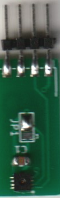

# diy_bayernluft-sensors

While our work to implement cheap DHT22 at: https://github.com/nielstron/diy_bayernluft . We also archived to create a PCB with the SHT31 that Bayernluft ships with there products.

The gerber file was ordered on jlcpcb.com

The SHT31 was ordered at mouser: https://www.mouser.de/ProductDetail/403-SHT31-DIS-B/
as well as the header pins with 2mm pitch: https://www.mouser.de/ProductDetail/855-M22-2580546/

The finished product can be seen here:

