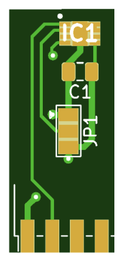

# diy_bayernluft-sensors

While our work to implement cheap DHT22 at: [diy_bayernluft](https://github.com/nielstron/diy_bayernluft), We also created a PCB with the SHT31 that Bayernluft ships with there products.

The gerber file was ordered on jlcpcb.com (best to order PCB with 1.2mm thickness)

The SHT31 was ordered at mouser: [SHT31-DIS-B2.5kS](https://www.mouser.de/ProductDetail/403-SHT31-DIS-B)

as well as the header pins with 2mm pitch: [Harwin M22-2580546](https://www.mouser.de/ProductDetail/Harwin/M22-2580546?qs=xxdqPuaJ%252Ba2PE%2FGuRM7plQ%3D%3D)

The schematic:

[Schematic](sch.png)

The designed and finished product can be seen here:

